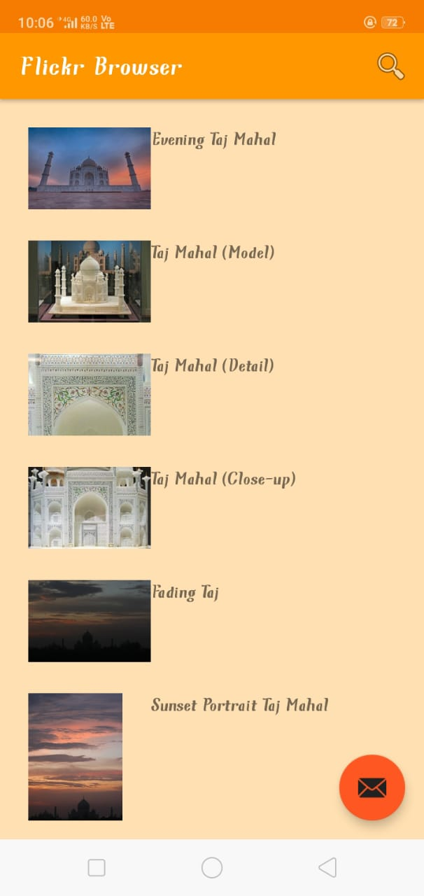

# Flickr

### An android based browser especially designed for effective image searching. Integrated with Flicker.com API for accessing the JSON database of images with relevant tags/ titles for effective search results.  Engineered long-press feature to display details of the image along with the author's name. Enabled user friendly display of the images using recyclerView and viewHolder. Added search view to search for images using searchView. 
 
 

## Programming Languages/Tech Stack used
---

 
 

## Tech Stack and Dependencies
---
### Kotlin 
### XML 
### REST API
### JSON Parsing
### Android Studio

 
 

## Screenshots
---

 
 

## Author
---
- [Sandeep Yadav](https://github.com/sandeep0614)
